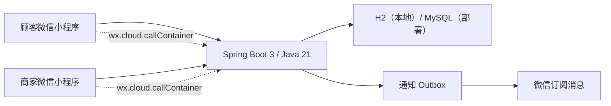

# 两个人的小外卖

一个仅限受邀用户使用的微信小程序：她像使用外卖平台一样挑选物品、规格和数量并下单；你在同一个小程序里管理商品、处理订单，并可接收微信订阅消息。

当前版本已经可以在备案完成前本地完整运行。价格是“心意值”，没有接入真实支付、配送或公开交易。

## 已实现

- 微信身份接入：本地用调试 OpenID，部署后读取微信云托管注入的 OpenID。
- 首次邀请码：BCrypt 哈希存储、单次/限次使用、有效期和失败限流。
- 顾客端：分类、搜索、规格、购物篮、留言、下单、订单记录、取消订单。
- 商家端：分类和商品 CRUD、可视化规格编辑、上下架、库存、图片、订单状态流转、生成顾客邀请码。
- 角色导航：顾客和商家分别拥有固定四栏底部导航。
- 订单安全：服务端重新计价、规格校验、库存锁、幂等键、商品快照和状态机。
- 微信提醒：新订单和订单状态订阅消息；本地以日志模拟。
- 工程能力：H2 本地数据库、MySQL 部署配置、Flyway、Docker、Maven Wrapper、CI 和端到端测试。

## 架构



本地和部署使用同一套页面与接口。两种运行模式只在
[`miniprogram/config/env.js`](miniprogram/config/env.js) 中切换：

- `local`：开发者工具访问 `http://127.0.0.1:8080`。
- `cloud`：调用微信云托管服务，由微信提供可信 OpenID。

更完整的设计见 [架构说明](docs/architecture.md)。

## 目录

```text
.
├── backend/                  Java 后端、数据库迁移与测试
├── miniprogram/              原生微信小程序
├── scripts/                  项目校验脚本
├── docs/                     接口、验收和部署文档
├── .github/                  GitHub Actions 与协作模板
├── docker-compose.yml        MySQL + 后端本地容器方案
├── project.config.json       微信开发者工具项目配置
└── pom.xml                   Maven 多模块入口
```

## 备案前本地运行

需要 Java 21、Node.js 20+ 和微信开发者工具。项目自带 Maven Wrapper，不需要单独安装 Maven。

```bash
# 1. 运行自动化测试
./mvnw test
npm test

# 2. 启动 Java 后端
./mvnw -pl backend spring-boot:run
```

看到应用启动后，可以另开终端检查：

```bash
curl http://127.0.0.1:8080/actuator/health
```

然后在微信开发者工具中导入本仓库根目录。当前 `project.config.json` 使用测试 AppID；本地验收时在“详情 / 本地设置”中启用“不校验合法域名”。

首次建议先初始化商家：

1. 邀请页点击“切换顾客/商家”。
2. 商家身份使用邀请码 `LOVE-MERCHANT`，昵称随意。
3. 在商家设置中点击“切换为顾客”。
4. 顾客身份使用邀请码 `LOVE-CUSTOMER`。
5. 顾客下单后，首页可切换回商家处理订单。

本地数据保存在 `.data/`，重启不会丢失。完整功能逐项检查见
[本地验收清单](docs/manual-test-checklist.md)。

## 常用命令

```bash
./mvnw test                         # 后端端到端测试
./mvnw -pl backend spring-boot:run # 启动本地服务
npm test                            # 小程序页面/JSON/JS 静态校验
docker compose up --build           # 有 Docker 时用 MySQL 运行
```

## 备案完成后的工作

代码无需重写，主要是创建真实小程序和云托管资源、填写 AppID/环境/服务名、配置 MySQL 与订阅消息模板，然后上传审核。逐项操作见
[微信部署清单](docs/wechat-deployment.md)。

## 文档

- [架构与安全边界](docs/architecture.md)
- [HTTP API](docs/api.md)
- [本地开发](docs/local-development.md)
- [完整验收清单](docs/manual-test-checklist.md)
- [备案后微信部署](docs/wechat-deployment.md)
- [参与贡献](CONTRIBUTING.md)
- [安全说明](SECURITY.md)

## 许可证

[MIT](LICENSE)
