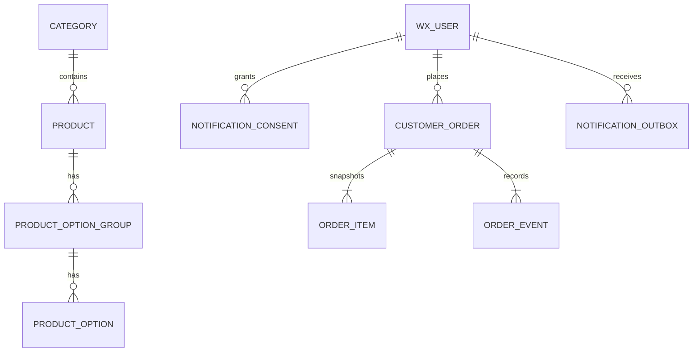
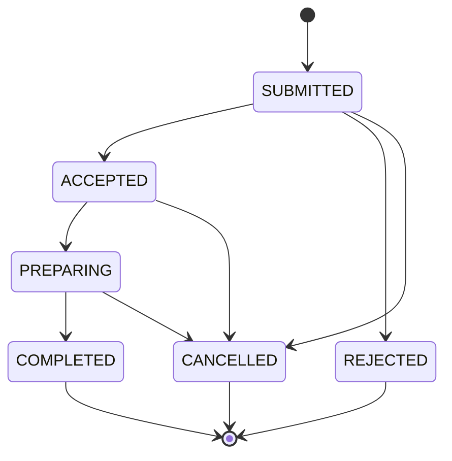

# 架构与安全边界

## 目标

系统服务于一位顾客和一位商家，但按可扩展到少量受邀用户设计。它不是公开电商平台，不处理真实货币，不保存收货地址和支付信息。

## 组件

### 微信小程序

原生 JavaScript/WXML/WXSS，不依赖 npm UI 框架。顾客和商家共用一个小程序，通过后端返回的 `role` 跳转到不同页面。

请求适配器封装在 `miniprogram/services/api.js`：

- 本地模式发送 `X-Debug-Openid`，只供开发环境使用。
- 云模式使用 `wx.cloud.callContainer`，后端读取微信注入的 `X-WX-OPENID`。

### Java 后端

Spring Boot 3.5、Java 21，按领域拆分：

- `user`：用户、邀请码、登录会话。
- `catalog`：分类、商品和规格。
- `order`：订单、快照、状态机和库存。
- `notification`：授权记录、Outbox、微信消息发送。
- `media`：本地图片存储接口。
- `security`：身份头解析与角色授权。

服务无 HTTP Session；每次请求都由可信身份头确定用户。商家接口统一放在 `/api/merchant/**`，由 Spring Security 强制要求 `MERCHANT` 角色。

### 数据库

本地默认使用 H2 文件库，部署使用 MySQL。Flyway 是唯一建表入口。

核心关系：

订单明细保存商品名、图片、规格和价格快照，因此商家之后修改或删除商品不会改变历史订单。

## 订单状态机

顾客只能在 `SUBMITTED` 时取消；商家可以接受、拒绝、开始准备、完成或在进行中取消。非法跨级更新返回 `409`。

## 关键安全措施

- 生产环境必须设置 `APP_IDENTITY_MODE=wechat-cloud`，绝不能接受调试身份头。
- 邀请码只存 BCrypt 哈希；接口生成的明文只返回一次。
- 同一 OpenID 连续输错邀请码会临时锁定。
- 商品价格、规格和库存均由服务端重新检查，客户端金额只用于展示。
- 下单使用 `(customer_id, idempotency_key)` 唯一约束避免重复订单。
- 商品读取库存时加悲观锁，避免并发超卖。
- 通知先写 Outbox，再由定时任务发送，微信短暂失败不会回滚订单。
- AppSecret、数据库密码和初始商家邀请码仅通过环境变量提供。

## 本地与生产差异

| 项目 | 本地 | 微信部署 |
|---|---|---|
| 身份 | `X-Debug-Openid` | `X-WX-OPENID` |
| 数据库 | H2 文件 | MySQL |
| 图片 | Java 本地目录 | 小程序云存储 `cloud://` |
| 通知 | Java 日志 | 微信订阅消息 |
| 初始数据 | 示例分类、商品、两个邀请码 | 空库 + 一次性商家邀请码 |

这些差异全部由配置控制，不需要分叉业务代码。
